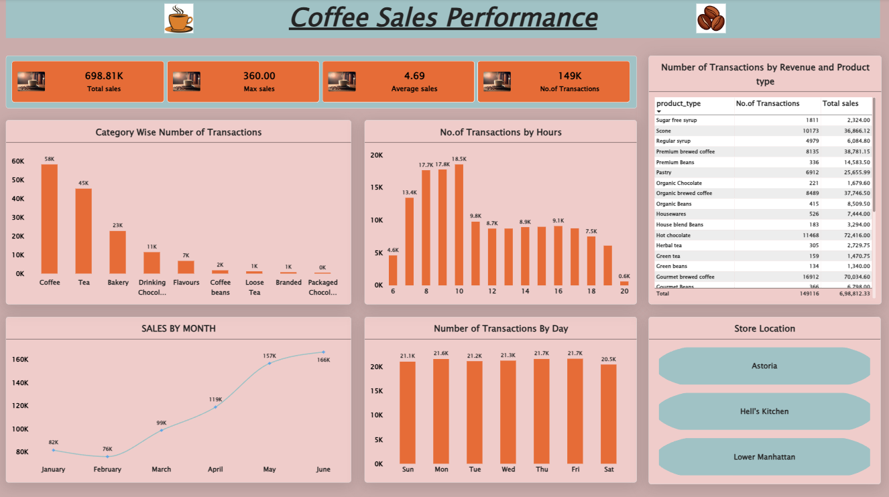

# Coffee Sales Performance Analysis

An interactive Power BI dashboard built to analyze coffee shop sales performance across products, categories, time periods, transaction activity, and store locations.

## Dashboard

## Key KPIs

- **Total Sales:** 698.81K
- **Maximum Sales:** 360.00
- **Average Sales:** 4.69
- **Number of Transactions:** 149K

## Analysis Covered

- Category-wise number of transactions
- Transactions by hour
- Monthly sales performance
- Transactions by day of the week
- Product-level transaction count and sales
- Store-location overview

## Dataset

The source dataset contains **149,116 transactions** from **January 1, 2023 to June 30, 2023**.

Main fields include:

- Transaction ID
- Transaction Date
- Transaction Time
- Transaction Quantity
- Store ID
- Store Location
- Product ID
- Unit Price
- Product Category
- Product Type
- Product Detail

## Tools Used

- Microsoft Power BI
- Microsoft Excel

## Repository Files

| File | Purpose |
|---|---|
| `Coffee_Sales_Performance.pbix` | Power BI dashboard/project file |
| `Coffee_Shop_Sales_Dataset.xlsx` | Source sales dataset |
| `dashboard.png` | Dashboard preview |

## How to Use

1. Download or clone this repository.
2. Open `Coffee_Sales_Performance.pbix` in Power BI Desktop.
3. If Power BI asks for the source file, select `Coffee_Shop_Sales_Dataset.xlsx`.
4. Refresh the data if required.
5. Explore the dashboard visuals and filters.

## Project Objective

The project demonstrates how transactional coffee shop data can be transformed into an interactive business dashboard for monitoring sales activity, transaction patterns, product performance, and store-level activity.
